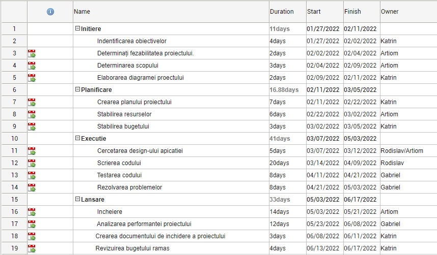

# Braileanu Gabriel P-1842

## Cuprins
* [Echipa](#echipa)
* [Informatie generala](#informatie-generala)
* [Limbaje](#limbaje)
* [Resurse](#resurse)
* [Imagine arhitecturala](#imagine-arhitecturala)

## Echipa
* Volkovschi Penelopa-Katrin - Project Manager
* Kozlov Artiom - Team Leader
* Zaharadji Rodisvlav - Java Developer
* Braileanu Gabriel - Tester

## Informatie generala
Acest proiect reprezinta o simpla aplicatie care va fi utilizata de institutiile de invatamant
	
## Resurse
* Umane - 4 oameni
* Financiare - $50 000
* Fizice
  * Calculatoare
  * Birouri
  * Transport
  * Întreținere
  * Furnizare de urgență
  * Asigurare
  * Securitate
* Informationale
  * anchete generale
  * date
  * articole
  * cărți
  * referințe
  * motoare de căutare(Google)
  * înregistrări interne 

## Limbaje
Proiectul a fost creat in:
* Java SE : 17.0.2
* Kotlin: 1.6.0
* Spring framework: 5.3.15
	
## imagine arhitecturala

 

